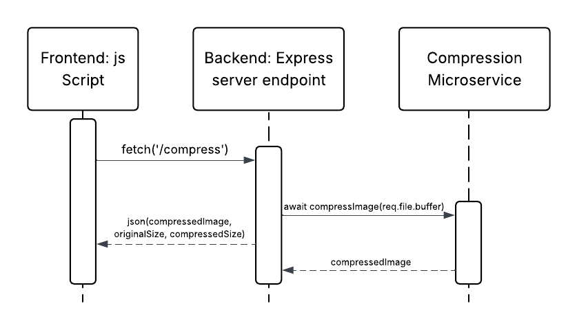

# Image Processing Microservice

## Overview
This microservice is designed to preprocess images for AI model analysis by compressing and normalizing them. It serves as a crucial preprocessing step in the image analysis pipeline, ensuring that images are properly formatted and optimized before being sent to AI models.

## Sprint Goal
The primary goal of this sprint is to implement a fully functional image processing microservice that can:
- Accept valid JPG/PNG image uploads
- Compress and normalize the images
- Return processed images as base64-encoded strings in JSON format

## User Stories

### 1. Process Image
**As a** user, **I want to** upload an image **so that** the service may preprocess my image for the AI model.

#### Functional Requirements
- **Given** a valid jpg/png
- **When** it's uploaded
- **Then** the service crops the image to 512x512 and normalizes pixel values

#### Non-Functional Requirements
- **Efficiency and Reliability**: The service must process an image up to 5MB in under three seconds
- **Memorability**: Image processing should not require any learning at all; once user uploads an image, no additional modals to prompt the user will appear, all the image processing will be done under the hood (backend endpoints)

### 2. Error Logging
**As a** user, **I want** a clear error message if there is an error **so that** I know something went wrong with the image I uploaded.

#### Functional Requirements
- **Given** an invalid file format
- **When** it's uploaded
- **Then** the service returns an error message

#### Non-Functional Requirements
- **Reliability**: Software should fail if clearly outlined conditions for image are not met
- **Reusability**: This error message user story can be applied to many generic image upload scenarios, e.g., for other students' projects

### 3. Return Processed Image
**As a** user, **I want** the image processing microservice to return a processed image in base64 JSON format **so that** I may use it to call an AI model.

#### Functional Requirements
- **Given** the image is of valid file type
- **When** it successfully processes
- **Then** the service returns the image in base64 format in a JSON

#### Non-Functional Requirements
- **Integrity**: Service should not crop the image, but rather compress it to avoid losing image data
- **Interoperability**: This image processing service can integrate with other parts of software easily by adding it to anywhere image uploads are accepted in the app. For example, if user needs to upload an image in the AI chatbot page, this image upload microservice can be used without needing to rewrite the whole thing

## Technical Requirements
- Maximum image size: 5MB
- Supported formats: JPG, PNG
- Processing time limit: 3 seconds
- Output format: Base64-encoded JSON
- Target image dimensions: 512x512 pixels

## Integration
This microservice is designed to be easily integrated into any part of the application that requires image processing. It can be used as a standalone service or as part of a larger image processing pipeline.

## API Documentation

### Endpoint
```
POST /compress
```

### Request Format
- Method: POST
- Content-Type: multipart/form-data
- Body: Form data with a file field named 'file'
- Supported file types: JPG, PNG
- Maximum file size: 5MB

### Response Format
```json
{
    "compressedFile": "data:image/jpeg;base64,...",
    "originalSize": 1234567,
    "compressedSize": 234567
}
```

### Using JavaScript/Fetch
```javascript
// Requesting data from the microservice
app.post('/compress', upload.single('file'), async (req, res) => {
    if (!req.file) {
        return res.status(400).json({ error: 'No file uploaded' });
    }
    
    try {
        const compressedFile = await compressImage(req.file.buffer);
        
        // Get the correct MIME type based on the original file
        const mimeType = req.file.mimetype.startsWith('image/png') ? 'image/png' : 'image/jpeg';
        
        // Convert buffer to base64 string with correct MIME type
        const base64String = `data:${mimeType};base64,${compressedFile.toString('base64')}`;
        
        res.status(200).json({ 
            compressedFile: base64String,
            originalSize: req.file.size,
            compressedSize: compressedFile.length
        });
    } catch (error) {
        console.error('Error compressing image:', error);
        res.status(500).json({ error: 'Failed to compress image' });
    }
});

// Example usage
const imageFile = document.querySelector('#imageInput').files[0];
try {
    const result = await compressImage(imageFile);
    console.log('Original size:', result.originalSize);
    console.log('Compressed size:', result.compressedSize);
    
    // Display the compressed image
    const img = document.createElement('img');
    img.src = result.compressedFile;
    document.body.appendChild(img);
} catch (error) {
    console.error('Error:', error);
}
```

### UML Sequence Diagram


